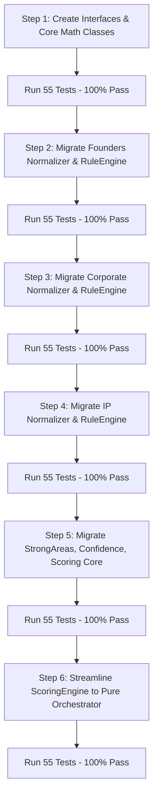

# ARCHITECTURE REFACTOR PLAN: Scoring Engine & Modular Refactoring

## 1. Executive Summary & Baseline Validation

- **Current Status**: Baseline test suite executed via `dotnet test tests/FenixLegalOs.Tests.csproj`.
- **Baseline Result**: **55 Passed, 0 Failed, 0 Skipped** (Total 55 tests, duration ~10s).
- **Scope**: Pure **Structural Refactoring** without changing business logic, question banks, weights, canonical facts, scores, findings, severity, suppressions, or test outcomes.

---

## 2. Inventory of Current Code & Domain Analysis

Currently, `Services/ScoringEngine.cs` (1,791 lines) contains 3 large classes with mixed generic and domain-specific responsibilities:

### A. `ConditionsEvaluator` (Lines 9–144)
* **Methods**:
  - `IsVisible(List<ConditionalRule>?, Dictionary<string, object>, SharedFactStore?)`
  - `EvaluateRule(ConditionalRule, Dictionary<string, object>, SharedFactStore?)`
  - `EvaluateOp(...)`
  - `RuleValueContains(...)`
* **Classification**: **Generic Core**.
* **Target Destination**: `Scoring/Core/ConditionsEvaluator.cs`.

### B. `FactNormalizer` (Lines 146–950)
* **Current Contents**:
  - **Founders Facts** (lines 153–420): `founders.count`, `founders.activeCount`, `founders.isSolo`, `founders.inactiveExists`, `founders.departedFounderStatus`, `founders.equityShares`, `founders.isEqual5050`, `founders.nearEqualControl`, `founders.founderAgreementStatus`, `founders.activeDispute`, `founders.disputeLevel`, `founders.roleClarity`, `founders.commitmentStatus`, `founders.equityClarity`, `founders.vestingStatus`, `founders.leaverRules`, `founders.governanceClarity`, `founders.keyDecisionMode`, `founders.deadlockMechanism`, `founders.exitRules`, `founders.personalContributions`, `founders.externalActivity`, `founders.strategicAlignment`.
  - **Corporate Facts** (lines 421–636): `company.entityStatus`, `company.entityCount`, `company.groupStructure`, `company.primaryJurisdiction`, `company.jurisdictions`, `company.structureNarrative`, `capital.ownershipMatch`, `capital.ownershipDispute`, `capital.capTableStatus`, `capital.equityPromises`, `capital.historyChanges`, `capital.historyStatus`, `capital.historyTrace`, `corporate.approvals`, `corporate.authority`, `company.entityAlignment`, `corporate.records`.
  - **IP Facts** (lines 638–855): `ip.coreProductExists`, `product.stage`, `ip.assets`, `ip.creators`, `ip.overallRightsEvidence`, `ip.founderRights`, `ip.employeeRights`, `ip.contractorRights`, `ip.formerCreatorStatus`, `ip.studioRights`, `ip.externalEmployerCreation`, `ip.employerResourcesUsed`, `ip.thirdPartyComponentsUsed`, `ip.thirdPartyTermsReview`, `ip.externalDependency`, `ip.criticalAccountsControl`, `ip.brandDomainControl`, `ip.brandRegistration`, `ip.contentProvenance`.
  - **Team, Activity, Revenue, Data, AI, Contracts, Investment Baseline Facts** (lines 858–895): `team.hasNonFounderTeam`, `company.hasRevenue`, `revenue.exists`, `data.personalDataProcessed`, `ai.used`, `ai.sensitiveDataSent`, `contracts.b2bRelevant`, `investment.timing`, `investment.priorInvestment`.
  - **Formatting & Parsing Helpers**: `FormatJurisdictionName`, `FormatRoleName`, `GetAnswerStr`, `GetAnswerList`.
* **Classification**: **Mixed Module-Specific & Baseline Normalization**.
* **Target Destination**:
  - `Scoring/Modules/Founders/FoundersFactNormalizer.cs` (`IFactNormalizer`)
  - `Scoring/Modules/Corporate/CorporateFactNormalizer.cs` (`IFactNormalizer`)
  - `Scoring/Modules/IP/IpFactNormalizer.cs` (`IFactNormalizer`)
  - `Scoring/Core/FactNormalizer.cs` (Composite orchestrator invoking all `IFactNormalizer` instances).

### C. `ScoringEngine` (Lines 952–1791)
* **Generic Scoring & Evaluation Logic**:
  - `ComputeResult(...)` (Orchestration)
  - `IsModuleApplicable(...)` (Routing & Module Applicability)
  - Dimension-level mathematical weighting & score aggregation
  - Question & Option confidence tracking and aggregation
  - Section-level weighting & score aggregation
  - Overall score weighted average formula
  - Level determination (`GetLevel`, `GetLevelTitle`, `GetLevelText`)
  - Confidence text determination (`GetConfidenceText`)
  - Dimension-Level Strong Areas calculation (`GetDimensionDisplayName`)
  - Investment Readiness overlay calculation
  - Consulting Recommendation calculation (`GetServiceCta`)
* **Module-Specific Finding Extraction (`CollectRawFindings`)**:
  - **Founders Rule Set** (lines 1230–1366): 18 canonical finding rules (`FND_ACTIVE_DISPUTE`, `FND_EQUITY_DISPUTE`, `FND_DEAD_EQUITY`, `FND_DEADLOCK`, `FND_NO_VESTING`, `FND_NO_DEADLOCK_PROTECTION`, `FND_INCOMPLETE_LEAVER_RULES`, `FND_ROLE_AMBIGUITY`, `FND_COMMITMENT_MISMATCH`, `FND_CONFLICT_OF_INTEREST`, `FND_GOVERNANCE_AMBIGUITY`, `FND_EXIT_RULES_MISSING`, `FND_CONTRIBUTION_AMBIGUITY`, `FND_STRATEGIC_MISALIGNMENT`, `FND_DOCUMENTATION_GAP`, `FND_DEPARTED_UNRESOLVED`, `FND_EQUITY_NOT_FORMALIZED`, `FND_EQUITY_AMBIGUITY`).
  - **Corporate Rule Set** (lines 1368–1446): 10 finding rules (`COR_NO_ENTITY_FOR_ACTIVITY`, `COR_OWNERSHIP_DISPUTE`, `COR_OWNERSHIP_MISMATCH`, `COR_CAP_TABLE_UNRELIABLE`, `COR_UNDOCUMENTED_EQUITY`, `COR_CORPORATE_HISTORY_GAP`, `COR_APPROVAL_GAP`, `COR_AUTHORITY_GAP`, `COR_ENTITY_MISMATCH`, `COR_RECORDS_GAP`).
  - **IP Rule Set** (lines 1448–1550): 11 finding rules (`IP_PRODUCT_RIGHTS_UNCONFIRMED`, `IP_FOUNDER_RIGHTS_NOT_TRANSFERRED`, `IP_CONTRACTOR_RIGHTS_GAP`, `IP_FORMER_DEVELOPER_GAP`, `IP_STUDIO_RIGHTS_GAP`, `IP_EMPLOYER_RISK`, `IP_THIRD_PARTY_COMPONENTS`, `IP_EXTERNAL_DEPENDENCY`, `IP_ACCESS_CONTROL`, `IP_BRAND_DOMAIN_CONTROL`, `IP_BRAND_REGISTRATION_INFO`).
* **Finding Suppression & Affected Dimensions**:
  - `MergeAndSuppressFindings(...)` (lines 1589–1644)
  - `GetAffectedDimensions(...)` (lines 1152–1202)

---

## 3. Cross-Module Dependencies & Rules

The analysis identified the following cross-module interactions:
1. **Cross-Module Fact Access**:
   - `CorporateRuleEngine` evaluates `COR_NO_ENTITY_FOR_ACTIVITY` by checking `company.entityStatus` AND cross-module facts (`company.hasRevenue`, `team.hasNonFounderTeam`, `investment.priorInvestment`).
   - `IpRuleEngine` evaluates `IP_PRODUCT_RIGHTS_UNCONFIRMED` by checking `ip.coreProductExists` AND `company.entityStatus`.
   - `IpRuleEngine` evaluates `IP_ACCESS_CONTROL` by checking `ip.criticalAccountsControl` AND `founders.activeDispute` / `founders.dispute`.
2. **Cross-Module Suppression**:
   - `IP_FORMER_DEVELOPER_GAP` suppresses `TEAM_FORMER_ACCESS_RISK` in `FindingProcessor`.
3. **Cross-Module Solo Founder Score Policy**:
   - In `Founders`: if `solo` and `!founders.inactiveExists`, normative module score = 100 per §22.1 & §23.1.
4. **Applicability Rules**:
   - `IsModuleApplicable` checks applicability of modules based on normalized facts (`company.entityStatus`, `team.hasNonFounderTeam`, `data.personalDataProcessed`, `ai.used`, `contracts.b2bRelevant`, `investment.timing`, `investment.priorInvestment`).

---

## 4. Proposed Target Architecture & File Tree

```
FenixLegalOs/
├── Scoring/
│   ├── ScoringEngine.cs                 [Orchestrator: coordinates pipeline, clean of FND_/COR_/IP_ literals]
│   │
│   ├── Interfaces/
│   │   ├── IFactNormalizer.cs           [void Normalize(IReadOnlyDictionary<string, object> answers, SharedFactStore facts)]
│   │   └── IModuleRuleEngine.cs         [string ModuleId { get; }, IReadOnlyList<RiskFinding> Evaluate(SharedFactStore facts, IReadOnlyList<RiskDefinition> definitions)]
│   │
│   ├── Core/
│   │   ├── ConditionsEvaluator.cs       [Evaluates showIf / skipIf rules]
│   │   ├── FactNormalizer.cs            [Composite fact normalizer orchestrator]
│   │   ├── DimensionScorer.cs           [Calculates dimension weighted scores]
│   │   ├── ModuleScorer.cs              [Calculates section/module scores & handles solo founder rule]
│   │   ├── OverallScorer.cs             [Calculates overall weighted score, level, level titles & texts]
│   │   ├── ConfidenceCalculator.cs      [Calculates answer confidence & confidence text]
│   │   ├── FindingProcessor.cs          [Finding registry, basis binding, suppression & severity ordering]
│   │   ├── StrongAreasCalculator.cs     [Dimension-level strong areas based on score >= 80 & no severe risks]
│   │   ├── InvestmentReadinessEvaluator.cs [Overlay calculation]
│   │   └── ConsultingEvaluator.cs       [Recommendation calculation]
│   │
│   └── Modules/
│       ├── Founders/
│       │   ├── FoundersFactNormalizer.cs
│       │   └── FoundersRuleEngine.cs
│       │
│       ├── Corporate/
│       │   ├── CorporateFactNormalizer.cs
│       │   └── CorporateRuleEngine.cs
│       │
│       ├── IP/
│       │   ├── IpFactNormalizer.cs
│       │   └── IpRuleEngine.cs
│       │
│       ├── Team/
│       ├── Product/
│       ├── DataAi/
│       ├── Contracts/
│       └── Investment/
```

---

## 5. Class-by-Class Method Allocation & Responsibilities

| Class | Source Location | Target Namespace / File | Key Responsibilities |
|---|---|---|---|
| `IFactNormalizer` | New | `FenixLegalOs.Scoring.Interfaces` | Contract for module fact normalizers |
| `IModuleRuleEngine` | New | `FenixLegalOs.Scoring.Interfaces` | Contract for module risk finding rule engines |
| `ConditionsEvaluator` | `ScoringEngine.cs` (L9–144) | `FenixLegalOs.Scoring.Core` | `IsVisible`, `EvaluateRule`, `EvaluateOp`, `RuleValueContains` |
| `FactNormalizer` | `ScoringEngine.cs` (L146–950) | `FenixLegalOs.Scoring.Core` | Orchestrates module normalizers + extracts baseline signals; maintains static `NormalizeFacts` backward compatibility |
| `FoundersFactNormalizer` | `ScoringEngine.cs` (L153–420) | `FenixLegalOs.Scoring.Modules.Founders` | Normalizes `founders.*` canonical facts (§24 / §22) |
| `CorporateFactNormalizer` | `ScoringEngine.cs` (L421–636) | `FenixLegalOs.Scoring.Modules.Corporate` | Normalizes `company.*`, `capital.*`, `corporate.*` canonical facts + helpers |
| `IpFactNormalizer` | `ScoringEngine.cs` (L638–855) | `FenixLegalOs.Scoring.Modules.IP` | Normalizes `ip.*`, `product.stage` canonical facts |
| `FoundersRuleEngine` | `ScoringEngine.cs` (L1230–1366) | `FenixLegalOs.Scoring.Modules.Founders` | Evaluates 18 canonical Founders findings |
| `CorporateRuleEngine` | `ScoringEngine.cs` (L1368–1446) | `FenixLegalOs.Scoring.Modules.Corporate` | Evaluates 10 Corporate findings |
| `IpRuleEngine` | `ScoringEngine.cs` (L1448–1550) | `FenixLegalOs.Scoring.Modules.IP` | Evaluates 11 IP findings |
| `DimensionScorer` | `ScoringEngine.cs` (L1010–1059) | `FenixLegalOs.Scoring.Core` | Computes dimension scores from question options and within-dimension weights |
| `ModuleScorer` | `ScoringEngine.cs` (L982–1086) | `FenixLegalOs.Scoring.Core` | Computes module/section score from dimensions, handles applicability & solo founder rule |
| `OverallScorer` | `ScoringEngine.cs` (L1088–1092, 1741–1769) | `FenixLegalOs.Scoring.Core` | Computes overall score, level, level title and text |
| `ConfidenceCalculator` | `ScoringEngine.cs` (L1031–1041, 1094–1098, 1771–1776) | `FenixLegalOs.Scoring.Core` | Computes diagnostic confidence score & confidence text |
| `FindingProcessor` | `ScoringEngine.cs` (L1553–1644, 1778–1789) | `FenixLegalOs.Scoring.Core` | Manages `AddFinding`, suppression rules, and severity ordering |
| `StrongAreasCalculator` | `ScoringEngine.cs` (L1104–1202, 1646–1675) | `FenixLegalOs.Scoring.Core` | Evaluates strong areas based on `dim.Score >= 80` and absence of CRITICAL/HIGH/BLOCKER findings |
| `ScoringEngine` | `ScoringEngine.cs` | `FenixLegalOs.Services` or `FenixLegalOs.Scoring` | Top-level orchestrator calling the pipeline steps in sequence |

---

## 6. Migration Sequence & Safety Invariants

We will execute the refactoring in strict, test-verified steps:



### Invariants Maintained During Migration:
- **No changes to public contracts**: `ScoringEngine.ComputeResult(Dictionary<string, object>)` and `FactNormalizer.NormalizeFacts(Dictionary<string, object>)` signatures remain identical.
- **Zero test regressions**: All 55 existing tests must pass at every step.
- **No hardcoded findings in ScoringEngine**: Strings `FND_`, `COR_`, `IP_` will be eliminated from `ScoringEngine.cs`.

---

## 7. Refactoring Risk Analysis & Mitigation

| Potential Risk | Likelihood | Impact | Mitigation Strategy |
|---|---|---|---|
| **Fact Normalization drift** (especially Founders §24) | Low | High | Unit tests explicitly assert `FactNormalizer.NormalizeFacts(...)`. We preserve exact mapping character-by-character. |
| **Cross-module fact timing** (Rule Engine evaluates fact before normalizer runs) | Low | High | `FactNormalizer.NormalizeFacts` runs all module normalizers in sequence BEFORE any `IModuleRuleEngine.Evaluate` is called. |
| **Suppression logic omission** | Low | High | `FindingProcessor` encapsulates all canonical suppression rules and verifies suppression order. |
| **Namespace breaking changes** in existing controllers/tests | Very Low | Medium | Keep common aliases/usings or global usings in `FenixLegalOs.Services` and `FenixLegalOs.Scoring`. |
